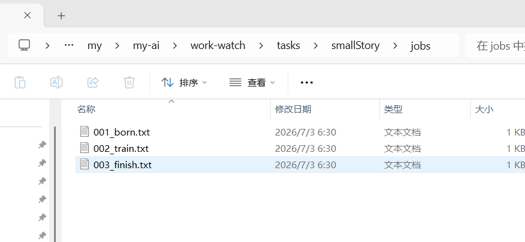
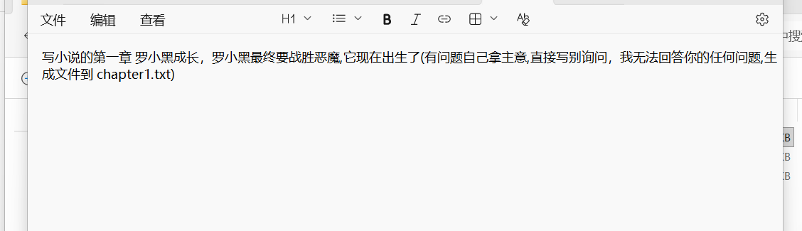
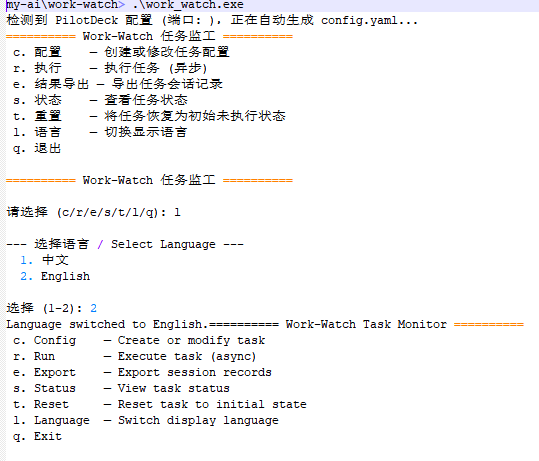
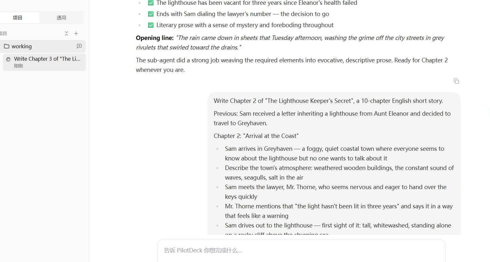
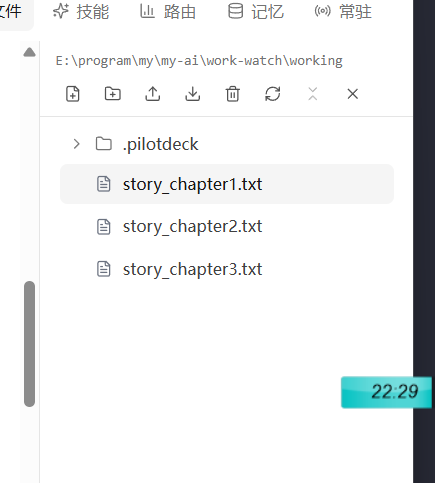
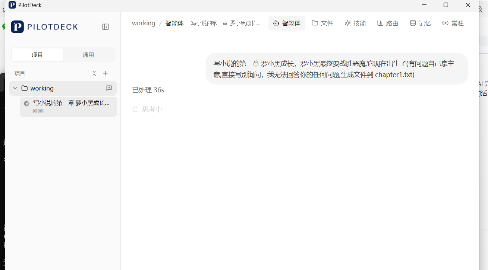
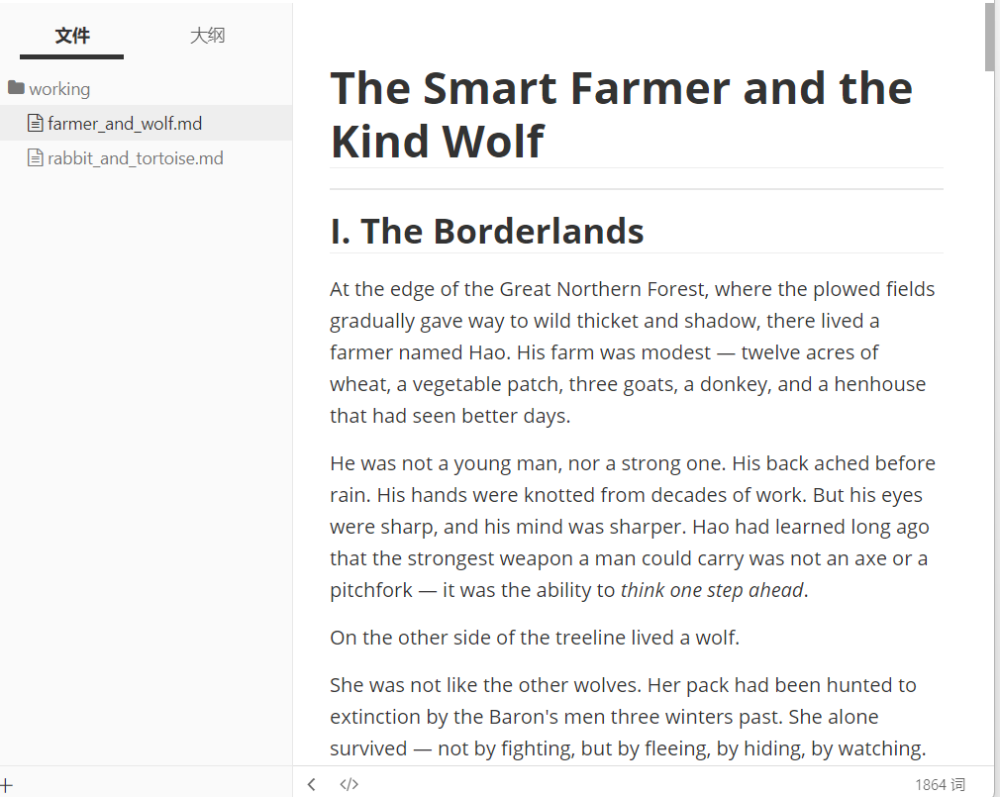
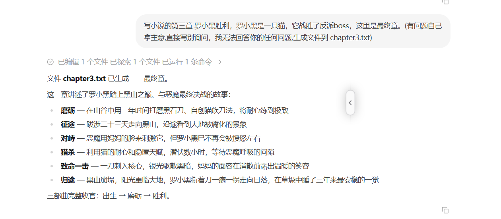

# work-watch

> 依赖 [PilotDeck](https://github.com/OpenBMB/PilotDeck)，使用前请先启动 PilotDeck。
>
> 典型场景：由电脑高手配置好 PilotDeck，其他用户只需使用 work-watch 即可。

一个命令行工具，用于批量驱动 PilotDeck AI Agent 执行多任务工作流。使用者只需在 `tasks/<任务名>/jobs/` 下写好 `*.txt` 文件，运行即可。

## 主要功能

- **批量任务执行** — 启动多个任务，每个任务将配置中的 jobs 逐一提交给 PilotDeck AI 处理
- **交互式菜单** — 无参数运行时进入菜单，可配置、运行、导出、查看状态、重置任务
- **进度追踪** — 实时显示每个 job 的执行状态和会话 ID
- **会话导出** — 支持 JSON / 报告 / 详细交互记录三种格式导出任务会话内容
- **自动配置发现** — 首次运行自动从 PilotDeck 读取连接信息，无需手动填写

## 基本用法

```
work-watch                 # 交互式菜单
work-watch <任务名>         # 直接运行指定任务
work-watch config <任务名>  # 配置任务
work-watch status          # 查看所有任务状态
work-watch export <任务名>  # 导出任务会话（默认 JSON）
work-watch reset <任务名>   # 重置任务会话
```

## 配置

程序首次运行自动从 `~/.pilotdeck/` 读取 PilotDeck 连接信息生成 `config.yaml`。每个任务目录下有独立的 `task.yaml` 保存会话状态。

## 演示






















