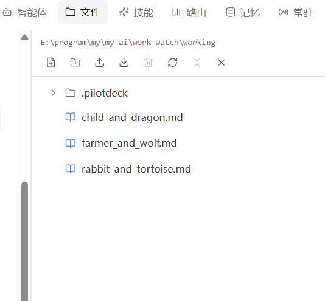

# work-watch

> 依赖 [PilotDeck](https://github.com/OpenBMB/PilotDeck) — 使用前请确保 PilotDeck 正在运行。
>
> 典型场景：电脑高手一次配好 PilotDeck，其他人只管运行 work-watch。

命令行工具，用于批量驱动 PilotDeck AI Agent 执行多作业工作流。用户只需在 `tasks/<任务名>/jobs/` 下写 `*.txt` 文件，然后运行。

## 功能

- **批量执行** — 运行多个任务，按顺序将每个作业提交给 PilotDeck AI
- **交互菜单** — 配置、运行、导出、查看状态和重置任务，无需记忆命令
- **进度跟踪** — 实时显示作业状态和每次提交的会话 ID
- **会话导出** — JSON / Markdown 报告 / 完整交互记录三种导出格式
- **自动发现** — 首次运行自动读取 PilotDeck 连接信息，零手动配置

## 使用方法

```
work-watch                   # 交互菜单
work-watch <任务名>          # 直接运行任务
work-watch config <任务名>   # 配置任务
work-watch status            # 查看所有任务状态
work-watch export <任务名>   # 导出会话（默认 JSON）
work-watch reset <任务名>    # 重置任务会话
```

## 配置说明

首次运行时，PilotDeck 连接信息从 `~/.pilotdeck/` 自动读取并生成 `config.yaml`。每个任务目录下有独立的 `task.yaml` 保存会话状态。

## 演示截图



